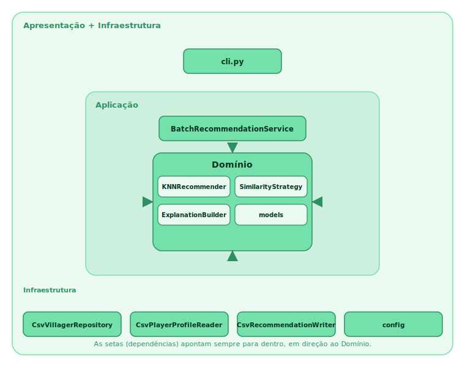
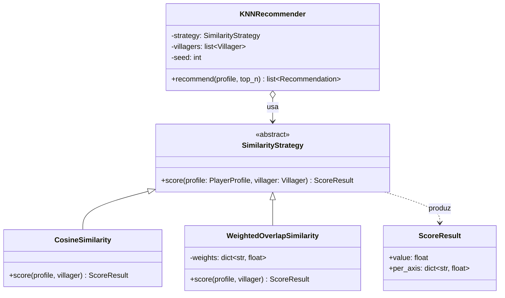
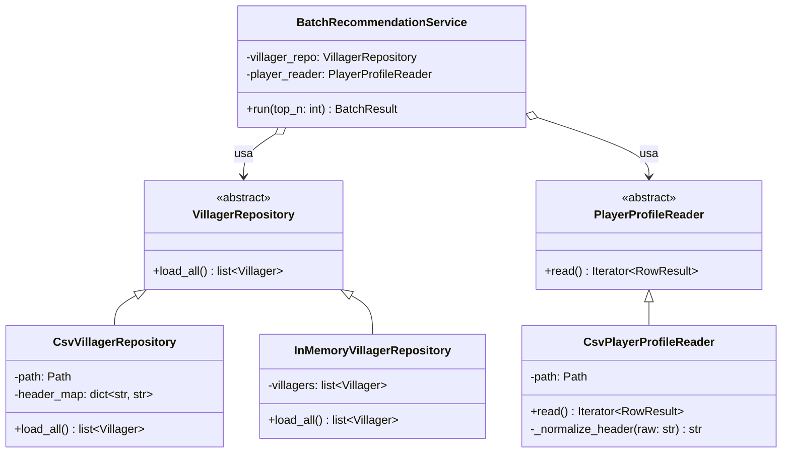

# NookMatcher — Arquitetura, Padrões de Codificação e Padrões de Projeto

---

## 1. Padrões de Codificação e Qualidade

Referência: **PEP 8** (estilo) + **docstrings no formato Google** (compatível com
PEP 257), com type hints (PEP 484) na fronteira pública.

### 1.1 Estilo (PEP 8)

- Indentação de **4 espaços**, nunca tabs.
- Comprimento máximo de linha: **79** colunas.
- Imports em três grupos separados por linha em branco (stdlib, terceiros, locais),
  absolutos e um por linha; sem `from x import *`.
- Duas linhas em branco entre definições de nível superior; uma entre métodos.
- Nomenclatura: `snake_case` para módulos, funções, métodos e variáveis;
  `PascalCase` para classes e exceções; `UPPER_SNAKE_CASE` para constantes;
  prefixo `_` para nomes não exportados.

### 1.2 Docstrings (formato Google)

Toda função/classe pública leva docstring: linha-resumo no imperativo, depois seções
`Args:`, `Returns:` e `Raises:` quando aplicáveis. Cada parâmetro em `Args:` traz o
tipo entre parênteses; a assinatura também leva type hints (PEP 484).

```python
def recommend(
    self, profile: PlayerProfile, top_n: int
) -> list[Recommendation]:
    """Ranqueia villagers por compatibilidade, em ordem decrescente.

    Args:
        profile (PlayerProfile): Perfil do jogador; eixos podem estar vazios.
        top_n (int): Quantidade de recomendações a retornar.

    Returns:
        list[Recommendation]: Os ``top_n`` villagers mais compatíveis.

    Raises:
        ValueError: Se ``top_n`` for menor ou igual a zero.
    """
```

### 1.3 Testes e Qualidade

Testes com **`unittest`** (biblioteca padrão) são obrigatórios. A CI inclui ainda
dois gates recomendados: **`black --check`** (verifica formatação sem alterar
arquivos) e **cobertura** via `coverage` sobre a execução do `unittest`.

| Função | Ferramenta | Status |
|--------|-----------|--------|
| Testes | `unittest` | **obrigatório** |
| Formatação (verificação) | `black --check` (line-length 79) | recomendado em CI |
| Cobertura | `coverage run -m unittest` + `coverage report` | recomendado em CI (mín. sugerido 80%) |

---

## 2. Arquitetura em Camadas

A **Aplicação** coordena o fluxo: ela usa o **Domínio** (algoritmo) e a
**Infraestrutura** (I/O de CSV). O **Domínio** é puro — não realiza I/O e não depende
da Infraestrutura; recebe os dados já carregados pela Aplicação. Isso mantém o
algoritmo testável e independente do formato de armazenamento.



### Responsabilidades

| Camada | Responsabilidade | Não pode |
|--------|------------------|----------|
| Apresentação | Ler argumentos, disparar o caso de uso, formatar mensagens. | Conter regra de recomendação. |
| Aplicação | Orquestrar o fluxo batch, iterar jogadores, coletar erros por linha (H2). | Implementar a regra de recomendação ou fazer parsing de CSV. |
| Domínio | Entidades, KNN, similaridade, justificativas (H1/H5), determinismo (H4). | Tocar disco ou rede. |
| Infraestrutura | Ler/escrever CSV por cabeçalho, ignorar colunas extras, carregar config. | Conter regra de negócio. |

### Trade-offs

- **Domínio isolado de I/O.** Justificado por testabilidade e separação de
  responsabilidades: o recomendador roda sem CSV, com a Aplicação fornecendo os
  dados já carregados. Determinismo (H4) é tratado à parte, via seed.
- **CSV como contrato fixo** (A2/Q1). Simples e alinhado à Nookipedia; menos flexível
  que API, mitigado pelo Repository (§3.2).
- **Content-based KNN** (C2). Torna as justificativas (H1/H5) triviais de gerar; abre
  mão de qualidade preditiva de modelos complexos, irrelevante aqui.
- **Ressalva:** o pitch cita filtragem colaborativa, mas nenhuma história nem o CSV
  fornecem matriz usuário–item. O núcleo é content-based; colaborativo fica como
  evolução futura, fora do esqueleto.

---

## 3. Padrões de Projeto

### 3.1 Strategy — métrica de similaridade

A compatibilidade pode ser calculada de mais de uma forma (cosseno vs. sobreposição
categórica ponderada). Encapsular cada métrica atrás de `SimilarityStrategy` permite
trocá-la sem alterar o `KNNRecommender`, e a variante ponderada alimenta as
justificativas (H1/H5).

Módulos: `domain/similarity.py` (estratégias), `domain/recommender.py` (contexto).



Os atributos são categóricos (personalidade, espécie, hobby, cor); `per_axis` expõe a
contribuição de cada eixo, que o `ExplanationBuilder` converte nos fatores exibidos
(H5, corte fixo por config). Custo: uma interface e indireção extras.

### 3.2 Repository — acesso a dados

A Aplicação não deve lidar com detalhes de CSV. A fonte de villagers é hoje um CSV da
Nookipedia (Q1) e pode virar API. A leitura de jogadores mapeia colunas por cabeçalho,
ignora colunas extras e reporta linhas inválidas sem abortar o lote (H2).

Módulos: `infrastructure/repositories.py`, `infrastructure/player_source.py`.



`header_map`/`_normalize_header` atendem ao mapeamento por cabeçalho; `RowResult`
carrega válido/erro para que o serviço reporte a linha e continue (H2). Permite trocar
CSV por `InMemoryVillagerRepository` em testes ou por API depois. Custo: duas
abstrações a mais.
