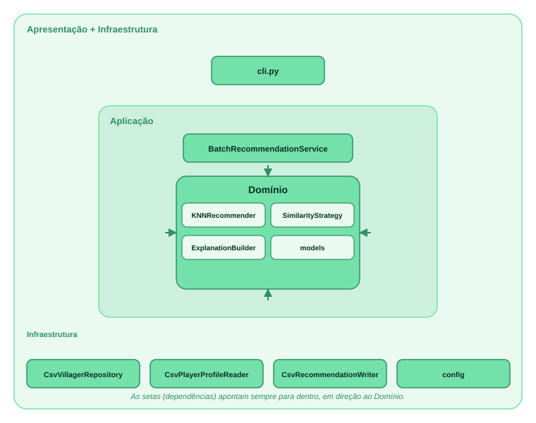
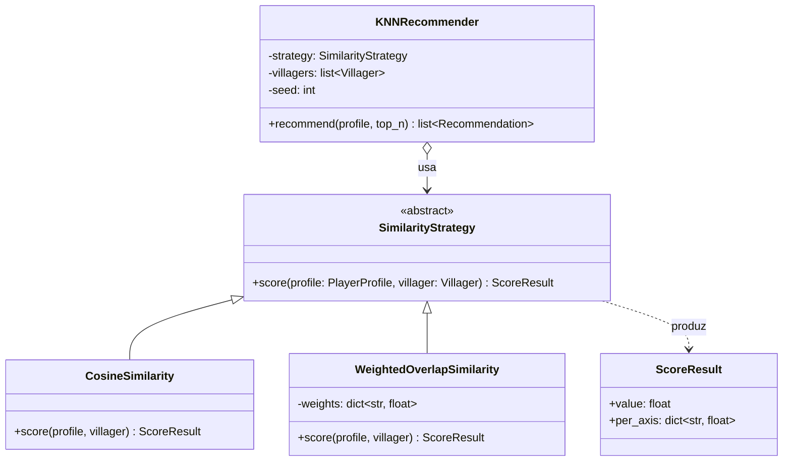
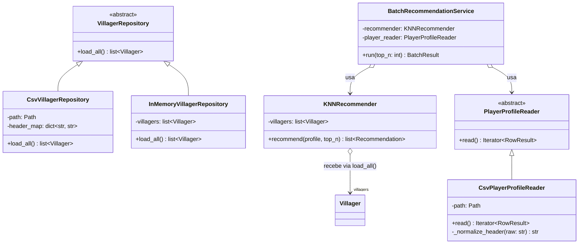

# NookMatcher — Arquitetura, Padrões de Codificação e Padrões de Projeto

---

## 1. Padrões de Codificação e Qualidade

Referência: **PEP 8** (estilo) + **docstrings no formato Google** (compatível com
PEP 257), com type hints (PEP 484) na fronteira pública.

### 1.1 Estilo (PEP 8)

- Indentação de **4 espaços**, nunca tabs.
- Comprimento máximo de linha: **79** colunas.
- Imports em três grupos separados por linha em branco (stdlib, terceiros, locais),
  absolutos e um por linha; sem `from x import *`.
- Duas linhas em branco entre definições de nível superior; uma entre métodos.
- Nomenclatura: `snake_case` para módulos, funções, métodos e variáveis;
  `PascalCase` para classes e exceções; `UPPER_SNAKE_CASE` para constantes;
  prefixo `_` para nomes não exportados.

### 1.2 Docstrings (formato Google)

Toda função/classe pública leva docstring: linha-resumo no imperativo, depois seções
`Args:`, `Returns:` e `Raises:` quando aplicáveis. Cada parâmetro em `Args:` traz o
tipo entre parênteses; a assinatura também leva type hints (PEP 484).

```python
def recommend(
    self, profile: PlayerProfile, top_n: int
) -> list[Recommendation]:
    """Ranqueia villagers por compatibilidade, em ordem decrescente.

    Args:
        profile (PlayerProfile): Perfil do jogador; eixos podem estar vazios.
        top_n (int): Quantidade de recomendações a retornar.

    Returns:
        list[Recommendation]: Os ``top_n`` villagers mais compatíveis.

    Raises:
        ValueError: Se ``top_n`` for menor ou igual a zero.
    """
```

### 1.3 Testes e Qualidade

Testes com **`unittest`** (biblioteca padrão) são obrigatórios. A CI inclui ainda
dois gates recomendados: **`black --check`** (verifica formatação sem alterar
arquivos) e **cobertura** via `coverage` sobre a execução do `unittest`.

| Função | Ferramenta | Status |
|--------|-----------|--------|
| Testes | `unittest` | **obrigatório** |
| Formatação (verificação) | `black --check` (line-length 79) | recomendado em CI |
| Cobertura | `coverage run -m unittest` + `coverage report` | recomendado em CI (mín. sugerido 80%) |

Para **garantir que estes padrões sejam de fato seguidos**, e não apenas
recomendados, os três gates rodam antes de cada merge para a `main` (ver §2): um
pull request só é integrado depois de `unittest` e `black --check` passarem.

---

## 2. Gerenciamento de Git

O fluxo de versionamento abaixo descreve a convenção já praticada no repositório
e que deve continuar sendo seguida.

### 2.1 Modelo de branches

- **`main`** é a branch estável e protegida; nada é commitado diretamente nela.
- Cada integrante trabalha em uma **branch própria** (`paludeto`, `julia`) ou em
  branches temáticas de curta duração.
- A integração na `main` acontece **exclusivamente via pull request**, nunca por
  push direto.

### 2.2 Mensagens de commit

- Escritas em **português, no imperativo presente**, descrevendo o efeito do
  commit (ex.: *"Implementa domínio, aplicação e infraestrutura"*,
  *"Documenta instruções de uso no README"*).
- Uma ideia por commit; o assunto resume a mudança em uma linha curta.

### 2.3 Pull requests

- Todo PR é revisado por outro integrante antes do merge.
- **Critério de merge:** os gates de qualidade da §1.3 (`unittest` e
  `black --check`) devem passar; mudanças de comportamento exigem testes.
- A `main` permanece sempre em estado executável.

---

## 3. Arquitetura em Camadas

### 3.1 Justificativa

A separação em camadas existe para **isolar a regra de negócio do I/O**. O
**Domínio** é puro — não toca disco nem rede e não conhece a Infraestrutura —, o
que mantém o algoritmo de recomendação testável e independente do formato de
armazenamento. A dependência aponta sempre para dentro: a **Apresentação** aciona
a **Aplicação**, que coordena **Domínio** e **Infraestrutura**, e o Domínio não
depende de nenhuma camada externa. Trocar CSV por uma API, ou a métrica de
similaridade, não exige tocar no núcleo. O custo é a indireção extra das
abstrações, justificada pela testabilidade e pela substituição de componentes.



### 3.2 Implementação dos componentes

Cada camada se materializa nos módulos abaixo. A coluna **"Não pode"** registra a
fronteira que mantém a justificativa acima válida.

| Camada | Módulos / classes | Responsabilidade | Não pode |
|--------|-------------------|------------------|----------|
| Apresentação | `presentation/cli.py` (`main`) | Ler argumentos, montar o grafo de dependências, disparar o caso de uso, formatar a saída no terminal. | Conter regra de recomendação. |
| Aplicação | `application/batch_service.py` (`BatchRecommendationService`, `BatchResult`, `PlayerResult`) | Orquestrar o fluxo batch, iterar jogadores, coletar erros por linha (H2). | Implementar a regra de recomendação ou fazer parsing de CSV. |
| Domínio | `domain/` (`entities`, `similarity`, `explanation`, `recommender`) | Entidades, KNN, similaridade, justificativas (H1/H5), determinismo (H4). | Tocar disco ou rede. |
| Infraestrutura | `infrastructure/` (`repositories`, `player_source`, `headers`, `output_writer`) | Ler/escrever CSV por cabeçalho, ignorar colunas extras. | Conter regra de negócio. |

---

## 4. Padrões de Projeto

Cada padrão abaixo está dividido em **justificativa** (por que adotá-lo) e
**implementação** (onde vive no código). A §4.3 fecha mostrando **onde cada
padrão é efetivamente instanciado**, para garantir que não são abstrações
decorativas.

### 4.1 Strategy — métrica de similaridade

**Justificativa.** A compatibilidade pode ser calculada de mais de uma forma
(cosseno vs. sobreposição categórica ponderada). Encapsular cada métrica atrás de
`SimilarityStrategy` permite trocá-la sem alterar o `KNNRecommender`, e a variante
ponderada expõe a contribuição por eixo que alimenta as justificativas (H1/H5).
Custo: uma interface e uma indireção extras.

**Implementação.** `domain/similarity.py` define a abstração e as estratégias;
`domain/recommender.py` é o contexto que as consome.


```mermaid
classDiagram
    class SimilarityStrategy {
        <<abstract>>
        +score(profile: PlayerProfile, villager: Villager) ScoreResult
    }
    class CosineSimilarity {
        +score(profile, villager) ScoreResult
    }
    class WeightedOverlapSimilarity {
        -weights: dict~str, float~
        +score(profile, villager) ScoreResult
    }
    class KNNRecommender {
        -strategy: SimilarityStrategy
        -villagers: list~Villager~
        -seed: int
        +recommend(profile, top_n) list~Recommendation~
    }
    class ScoreResult {
        +value: float
        +per_axis: dict~str, float~
    }
    SimilarityStrategy <|-- CosineSimilarity
    SimilarityStrategy <|-- WeightedOverlapSimilarity
    KNNRecommender o--> SimilarityStrategy : usa
    SimilarityStrategy ..> ScoreResult : produz
```

Os atributos são categóricos (personalidade, espécie, hobby, cor, estilo);
`per_axis` expõe a contribuição de cada eixo, que o `ExplanationBuilder` converte
nos fatores exibidos (H5, corte fixo por config).

### 4.2 Repository — acesso a dados

**Justificativa.** A Aplicação não deve lidar com detalhes de CSV. A fonte de
villagers é hoje um CSV da Nookipedia (Q1) e pode virar API; a leitura de
jogadores mapeia colunas por cabeçalho, ignora colunas extras e reporta linhas
inválidas sem abortar o lote (H2). Abstrair o acesso atrás de `VillagerRepository`
e `PlayerProfileReader` permite trocar a fonte (CSV → `InMemoryVillagerRepository`
nos testes, ou API depois) sem tocar na regra de negócio. Custo: duas abstrações a
mais.

**Implementação.** `infrastructure/repositories.py` (catálogo de villagers) e
`infrastructure/player_source.py` (perfis de jogadores). O
`BatchRecommendationService` (Aplicação) **não** conhece os repositórios: ele
recebe um `KNNRecommender` já carregado e um `PlayerProfileReader` — quem instancia
o `CsvVillagerRepository` e injeta o catálogo no recomendador é o composition root
(`cli.main`, ver §4.3).


```mermaid
classDiagram
    class VillagerRepository {
        <<abstract>>
        +load_all() list~Villager~
    }
    class CsvVillagerRepository {
        -path: Path
        -header_map: dict~str, str~
        +load_all() list~Villager~
    }
    class InMemoryVillagerRepository {
        -villagers: list~Villager~
        +load_all() list~Villager~
    }
    class PlayerProfileReader {
        <<abstract>>
        +read() Iterator~RowResult~
    }
    class CsvPlayerProfileReader {
        -path: Path
        +read() Iterator~RowResult~
        -_normalize_header(raw: str) str
    }
    class KNNRecommender {
        -villagers: list~Villager~
        +recommend(profile, top_n) list~Recommendation~
    }
    class BatchRecommendationService {
        -recommender: KNNRecommender
        -player_reader: PlayerProfileReader
        +run(top_n: int) BatchResult
    }
    VillagerRepository <|-- CsvVillagerRepository
    VillagerRepository <|-- InMemoryVillagerRepository
    PlayerProfileReader <|-- CsvPlayerProfileReader
    KNNRecommender o--> "villagers" Villager : recebe via load_all()
    BatchRecommendationService o--> KNNRecommender : usa
    BatchRecommendationService o--> PlayerProfileReader : usa
```

`header_map`/`_normalize_header` atendem ao mapeamento por cabeçalho; `RowResult`
carrega válido/erro para que o serviço reporte a linha e continue (H2).

### 4.3 Onde os padrões são efetivamente usados

Os padrões não são teóricos: o **composition root** em `presentation/cli.py`
(`main`) é o único ponto que instancia as implementações concretas e as injeta nas
abstrações — confirmando que cada padrão tem uso real no fluxo de execução.

| Padrão | Abstração | Implementação concreta | Instanciado / injetado em |
|--------|-----------|------------------------|---------------------------|
| Strategy | `SimilarityStrategy` | `WeightedOverlapSimilarity` (padrão), `CosineSimilarity` | `cli.main` cria a estratégia e a passa ao `KNNRecommender`. |
| Repository (villagers) | `VillagerRepository` | `CsvVillagerRepository`, `InMemoryVillagerRepository` (testes) | `cli.main` instancia o CSV e injeta `load_all()` no `KNNRecommender`. |
| Repository (jogadores) | `PlayerProfileReader` | `CsvPlayerProfileReader` | `cli.main` injeta o leitor no `BatchRecommendationService`. |
| Value Object / DTO | — | `Villager`, `PlayerProfile`, `ScoreResult`, `Recommendation` (`frozen dataclass`) | Criados nas camadas de Domínio e Infraestrutura ao longo do fluxo. |

Trecho do composition root (`cli.main`) que faz a costura:

```python
villager_repo = CsvVillagerRepository(villagers_path)   # Repository
player_reader = CsvPlayerProfileReader(input_path)       # Repository
strategy = WeightedOverlapSimilarity()                   # Strategy
recommender = KNNRecommender(
    strategy=strategy,
    villagers=villager_repo.load_all(),
    seed=args.seed,
)
service = BatchRecommendationService(
    recommender=recommender,
    player_reader=player_reader,
)
```
